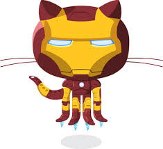

<b> What´s Up, Devs!! </b>

<h3 align="center"><b> I´m Emerson Pessoa </b></h3>

-🌱I have a degree in Industrial Chemistry and recently graduated in Computer Networks. 
-In the beginning of 2020, out of curiosity. 
-And soon I fell in love with programming. 
-Since then I haven't stopped wanting to learn about the Dev world. 

 <!--]-->
 

### Contributors:
[  Git Ironman ](https://github.com/emersonpessoa01) | [  Git Octodex ](https://github.com/emersonpessoa01) | [  Octocat Nerd ](https://github.com/emersonpessoa01) | [  Mestre Yoda ](https://github.com/emersonpessoa01) |
| :---: | :---: | :---: | :---: |

### Language and Tools:

 

 

 
  |  | 
 | :---:| :---: |

<!--
**emersonpessoa01/emersonpessoa01** is a ✨ _special_ ✨ repository because its `README.md` (this file) appears on your GitHub profile.

Here are some ideas to get you started:

- 🔭 I’m currently working on ...
- 🌱 I’m currently learning ...
- 👯 I’m looking to collaborate on ...
- 🤔 I’m looking for help with ...
- 💬 Ask me about ...
- 📫 How to reach me: ...
- 😄 Pronouns: ...
- ⚡ Fun fact: ...
-->
