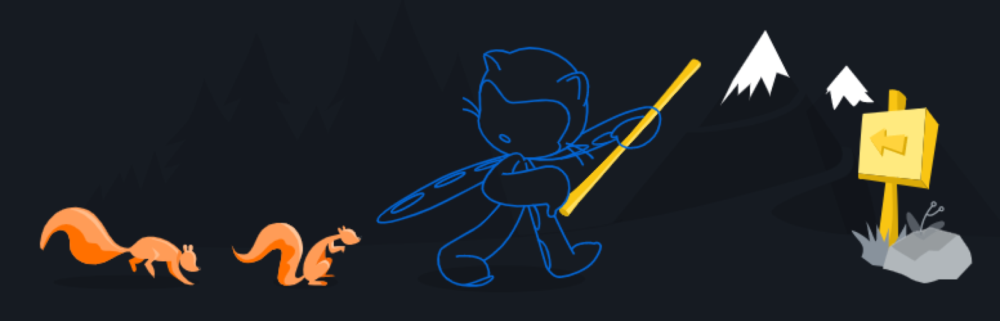
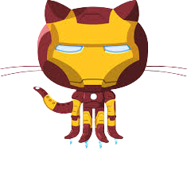

<h2 align="center"></h2>

⚗️ Formado em Processos Químicos Industriais pela IFPA-Instituto Federal do Pará. 
💻 Redes de Computadores pela FAP-Faculdade do Estado do Pará. 
:books: Entusiasta em <b>programação</b>. 
☕ Curto bastante <b>café</b>. 
📽️ Gosto de assistir séries e filmes. 
🤘🏻 Gosto de escutar <b>rock</b> e de bater um bom papo sobre diversos assuntos!!! 

<!-- 👨‍💻 Atualmente estou envolvido no <b>Programa Desenvolve 2022 da Boticário com trilha FullStack ministrado pela Alura</b>. -->

<!--

  &nbsp;
 &nbsp;
 &nbsp;
&nbsp;
 <!--]
 

<b> What´s Up, Devs!! </b>

<h3 align="center"><b> I´m Emerson Pessoa</b></h3> 

 -->

##

<h3><b> Social:</h3></b>
   
  
  <!--  -->
 <!-- 
 
 -->

##

 <h3> Contribuidores fake: </h3>
 
[  Git Ironman ](https://github.com/emersonpessoa01) | [  Git Code ](https://github.com/emersonpessoa01) | [  Ahsoka Tano](https://github.com/emersonpessoa01) | [  Ezra Bridges](https://github.com/emersonpessoa01) | [  Sabine Wren](https://github.com/emersonpessoa01)
| :---: | :---: | :---: | :--: | :--: |

<!--

<h3><b> Language and Tools:</h3></b>
 

 

 

 

 |  |
 | :---:| :---: |

 -->

##

<h3><b> Linguagens e ferramentas:</h3></b>

<a href="https://cdn.jsdelivr.net/gh/devicons/devicon/icons/github/github-original.svg" target="_blank" rel="noopener noreferrer nofollow">
<!-- </a> -->

<!--  -->

<!--  -->

<!--  -->
<!--  -->
<!--  -->

<!--  -->
<!--  -->
<!--  -->
<!--  -->
<!--  -->
<!--  -->
<!--  -->
<!--  -->

<!--  -->
<!--  -->

  

<!-- 

<!--  -->
<!--  -->

 
 <!--ESTILOS DE BADGES

 
 
 
-->
 
 

 
 ##
 

  <a href="https://github.com/emersonpessoa01">
  
  

 
 
 
 <h3>Visualizações:</h3>
 
 

 

 
 
 

<!--
**emersonpessoa01/emersonpessoa01** is a ✨ _special_ ✨ repository because its `README.md` (this file) appears on your GitHub profile.

Here are some ideas to get you started:

- 🔭 I’m currently working on ...
- 🌱 I’m currently learning ...
- 👯 I’m looking to collaborate on ...
- 🤔 I’m looking for help with ...
- 💬 Ask me about ...
- 📫 How to reach me: ...
- 😄 Pronouns: ...
- ⚡ Fun fact: ...
-->
